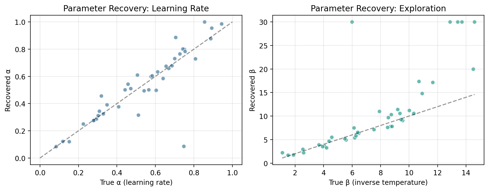

# RL Behavioral Modeling: Exploration-Exploitation in Human Decision-Making

This project models human decision-making behavior in a multi-armed bandit task using reinforcement learning. It simulates how people balance exploration and exploitation, a core question in computational neuroscience and behavioral research.

## Background

In many real-world decisions, people must choose between options with uncertain rewards. The multi-armed bandit is a classic paradigm to study this:

- A participant repeatedly chooses between `N` slot machines ("arms")
- Each arm has a hidden reward probability
- The goal is to maximize total reward over time

This project fits three computational models to simulated human behavior and compares their performance.

## Models Implemented

| Model | Description |
| --- | --- |
| `Random` | Baseline model that chooses randomly |
| `Greedy` | Always picks the arm with the highest observed reward |
| `Q-Learning (softmax)` | Learns reward values and explores via a temperature parameter |

## Parameter Recovery

The key model-check in this project is parameter recovery: after simulating participants with known learning-rate and exploration parameters, the model is fit back to those data to test whether it can recover the original values.



## Project Structure

```text
rl-behavioral-modeling/
|-- bandit_task.ipynb
|-- bandit_task.py
|-- generate_readme_assets.py
|-- assets/
|-- requirements.txt
`-- README.md
```

## How to Run

```bash
git clone https://github.com/selindgnr/rl-behavioral-modeling.git
cd rl-behavioral-modeling
python -m pip install -r requirements.txt
python generate_readme_assets.py
python -m notebook bandit_task.ipynb
```

## Key Results

- Q-learning with softmax exploration outperforms both random and greedy strategies.
- Learning rate (`alpha`) and temperature (`beta`) jointly shape exploration behavior.
- Parameter recovery shows the model can recover the true simulated parameters reasonably well.

## Relevance

This codebase is inspired by work at the Max Planck Institute for Biological Cybernetics, where similar models were used to characterize exploration-exploitation dynamics in human behavioral experiments.

## Dependencies

`numpy` · `matplotlib` · `scipy` · `pandas` · `jupyter`
